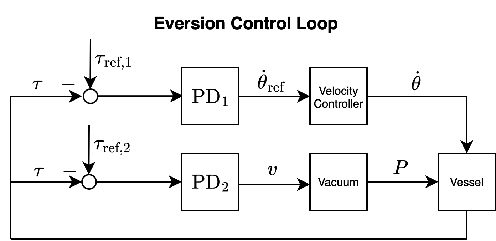

# Control Strategy

This document outlines the control strategy employed in the GentleGlide/Wedge.

**Legend**:

| Symbol | Description |
|-|-|
| $\theta$ | Motor angle (referred to as "position"). |
| $\dot{\theta}$ | Motor angular velocity (referred to as "velocity") |
| $\dot{\theta}_{\text{ref}}$ | Reference or desired motor velocity. |
| $\tau$ | Measured torque that the motor is applying. |
| $\tau_{\text{ref}}$ | Reference or desired torque. |
| $v$ | The "percentage" of voltage supplied to the vacuum. The relationship to the actual voltage is non-linear. |
| $P$ | The measured air pressure inside the vessel. |
| $P_{\text{ref}}$ | The reference or desired pressure. |

## Eversion

For eversion, the goal of the control loop is to regulate the tension in the cable by commanding the air supply to increase when tension is too low, and decrease when the tension is too high. In cases where the desired tension cannot be achieved, the motor should slow down to a halt to prevent the motor from unwinding the cable too far while the sheet is jammed.

This control strategy has the effect of automatically adjusting pressure depending on the load that the sheet is under (e.g. the upper back area is a heavier load so the pressure would automatically increase when burrowing underneath, then decrease back to a lower level once getting past that hurdle).

**Control Loop**

To achieve this control strategy, we employ the following control loop:

The measured torque $\tau$ is subtracted from the hand-tuned reference torques $\tau_{\text{ref},1},\tau_{\text{ref},2}$ which produce errors $e_1,e_2$ that are supplied as input to two separate proportional-derivative (PD) blocks.

The first PD block modulates the desired motor velocity $\dot{\theta}_ {\text{ref}}$ such that the velocity decreases when the torque is too far below the setpoint, and increases when the torque is at or near the setpoint. Similarly, the second PD block modulates the vacuum's voltage supply $v$ such that the air supply is increased when the torque is below the setpoint and decreases otherwise. Both $\dot{\theta}_{\text{ref}}$ and $v$ are constrained to minimum and maximum values to prevent excessive speed or air supply.

As pictured below, the first reference torque $\tau_{\text{ref},1}$ is used as a threshold to slow down the motor when the tension in the cable gets too low, while the second reference torque $\tau_{\text{ref},2}$ is used as the setpoint to achieve the desired cable tension. This allows for the controller to only slow down the motor's velocity when the controller is confident that the tension is too low.

The reference velocity and voltage supply are then supplied into the velocity controller and vacuum, respectively, which produces an actual motor velocity $\dot{\theta}$ and pressure $P$ inside the vessel. A new torque $\tau$ is then produced and measured, closing the feedback loop.

**Why Command $v$ Instead of $P_{\text{ref}}$?**

Although it's possible for the second PD block to instead output a reference pressure $P_{\text{ref}}$ which gets supplied into an inner pressure control loop, we opted for the simpler approach of directly commanding $v$. This approach was chosen because both pressure and torque are very noisy signals and require relatively long band-pass filters to get a clean signal. This filtering causes latency in the controller's response time, and nesting a pressure control loop inside the tension control loop would exacerbate this issue.

**Variable Shaft Radius**

Because the shaft's radius $r$ is not constant, but depends on the motor's position $\theta$, this controller does *not* actually achieve constant cable tension throughout the eversion. To achieve constant tension, it's possible to model $r$ as having a linear relationship to $\theta$, which would in turn make $\tau_{\text{ref}}$ dependent on $\theta$. However, we have found that achieving constant tension is not strictly necessary. By tuning $\tau_{\text{ref}}$ to the smallest possible shaft radius $r_{\text{min}}$, the control loop can continue to maintain sufficient tension in the cable for larger radii without introducing new issues. We therefore opt for the simpler solution of tuning $\tau_{\text{ref}}$ to be large enough to work under the minimum shaft radius rather than modeling it as a function of $\theta$.

**Constraints (GentleGlide)**

The variables used in this controller are constrained to the following ranges:

| Variable | Min | Max |
|-|-|-|
|$v$|20%|40%|
|$\dot{\theta}_{\text{ref}}$|4 rpm|20 rpm
|$P$| - | 0.75 PSI |

## Inversion

For inversion, the goal is simply to maintain a defined reference velocity $\dot{\theta}_ {\text{ref}}$ and pressure $P_{\text{ref}}$ by commanding the motor current and vacuum's voltage supply.

We define $\dot{\theta}_{\text{ref}}$ as a piecewise-linear function of $\theta$ in the following form:

The velocity has a ramp down to $0$ to counteract the effect of the sheet inverting faster as the radius of the shaft increases. Since the on-board ODrive controller encapsulates the velocity control loop, the velocity controller's implementation details are not provided here.

$P_{\text{ref}}$ is defined to be a constant value tuned such that it is low enough to prevent the motor from requiring excessive torque, but high enough that the sheet is inflated to not cause excess friction. The control loop for the pressure is as follows:

Note that the pressure inside the vessel $P$ would typically increase as the sheet inverts. Therefore, by regulating $P$ to be constant, it has the effect of decreasing the vacuum's voltage supply as the sheet gets closer to being fully inverted.

Throughout the inversion process, the motor's torque is monitored to ensure that it remains within a typical operating range. If the torque exceeds a tuned threshold, it is a sign that the system is not inverting properly (e.g. buckling or something getting caught in between) and the system stops itself to prevent possible damage.