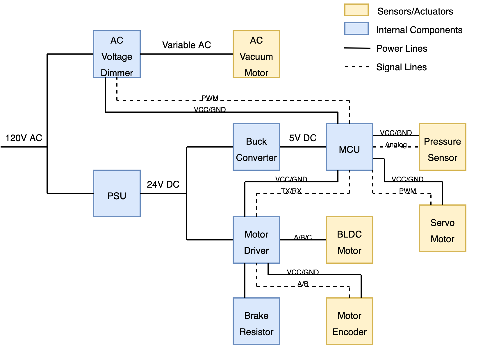
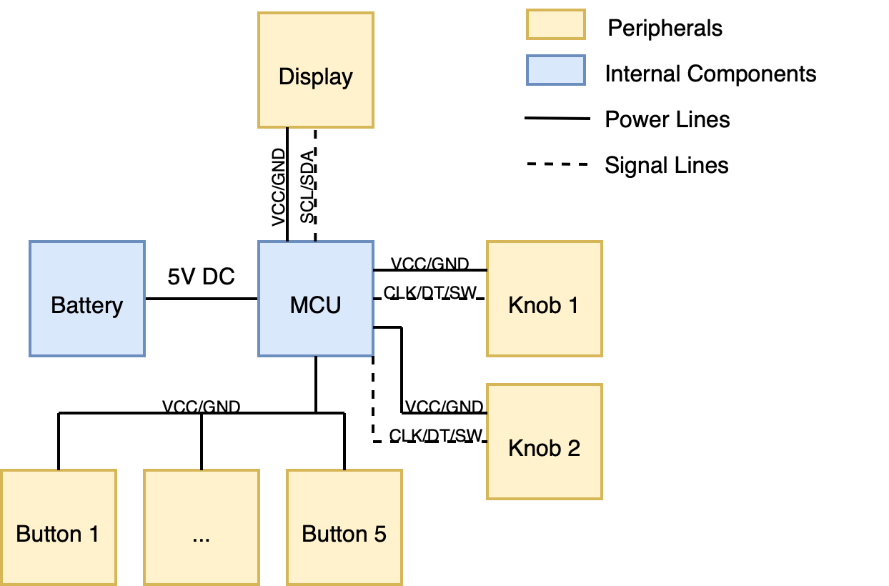

# Electronics Wiring

This document outlines the wiring systems used in GentleGlide and GentleWedge.

## GentleGlide/Wedge

For both GentleGlide and GentleWedge the wiring setup is identical. The power begins as 120V AC (coming from a wall outlet) and branches into two modules: an AC voltage dimmer that can dim the AC voltage to a lower level (and is later fed into a vacuum motor), and a power supply that converts the AC voltage into 24V DC voltage.

The 24V DC voltage is further branched into another two modules: a buck converter that steps the voltage down to 5V DC, and a motor driver that later passes the power to a brushless DC motor. The 5V DC power line is used to power the microcontroller unit (MCU), and all subsequent peripherals that the MCU interfaces with. This includes:
- AC Voltage Dimmer: The MCU communicates with the voltage dimmer via PWM, which allows for the voltage supplied to the vacuum motor to be controlled from the MCU.
- Pressure Sensor: The MCU reads an analog voltage signal from the pressure sensor via an on-board analog-digital converter (ADC).
- Servo Motor: The MCU controls the angle of a servo motor (used for controlling air channels on the platform) via PWM.
- Motor Driver: The MCU communicates with the motor driver serially via TX/RX pins, which itself has an on-board chip that handles motor velocity/position control.

NOTE: The voltage dimmer we currently use also converts the incoming AC power to 5V DC, so the buck converter is optional (and not used in GentleGlide).

The motor driver provides power to the BLDC motor through the three A/B/C power lines. It also communicates with the motor's encoder via the A/B quadrature encoding lines. There is additionally a brake resistor attached to the motor driver which is used for absorbing excess current when the motor brakes.

## GentleRemote

The GentleRemote consists of a battery that provides 5V DC power to a microcontroller, which then interfaces with five buttons, two knobs (which also act as push-buttons) and a small OLED display. The MCU interfaces with the display via SCL/SDA pins, the buttons via input pull-up resistors, and the knobs via the CLK/DT/SW pins.

## Parts List & Pinouts

- AC Voltage Dimmer: https://www.amazon.com/dp/B07CT8F9KX?ref=fed_asin_title
- Vacuum: https://hovermatt.com/wp-content/uploads/2020/04/hov_Air200G-Air400GManual-RevD_040220.pdf, https://hovertechinternational.com/wp-content/uploads/2025/03/hov_HT-Air1200Manual_RevH_121223.pdf
- 120V AC to 24V DC PSU: https://www.amazon.com/dp/B0CDB8MMRF?ref=fed_asin_title&th=1
- Buck Converter: https://www.amazon.com/dp/B07L915WKX?ref=fed_asin_title
- MCU: https://www.amazon.com/dp/B0D8S22V7L?ref=fed_asin_title&th=1 https://myhomethings.eu/en/esp32-pinout-which-pin-is-for-what/
- Motor Driver (comes with brake resistor): https://shop.odriverobotics.com/products/odrive-s1, https://docs.odriverobotics.com/v/latest/hardware/s1-datasheet.html
- BLDC Motor w/ encoder: https://www.maxongroup.com/maxon/view/product/motor/ecmotor/EC-i/579165, https://www.maxongroup.com/maxon/view/product/sensor/encoder/Magnetische-Encoder/ENCODER16EASY/499361, https://www.maxongroup.com/maxon/view/product/gear/planetary/gp52/223093
- Servo motor: https://www.amazon.com/dp/B097DWW6PY?ref=fed_asin_title&th=1
- Pressure sensor: https://www.amazon.com/dp/B08G8MCGKH?ref=fed_asin_title (GentleWedge), https://www.smcworld.com/catalog/Clean-en/mpv/cat02-23-ss-pse540_en/data/cat02-23-ss-pse540_en.pdf (GentleGlide)
- OLED Display: https://www.amazon.com/dp/B0D2RMQQHR?ref=fed_asin_title
- Knobs: https://www.amazon.com/dp/B07B68H6R8?ref=fed_asin_title
- Buttons: https://www.amazon.com/dp/B083JWJPW5?ref=fed_asin_title&th=1
- Molex connectors: https://www.amazon.com/dp/B0753VW1B4?ref=fed_asin_title https://www.amazon.com/dp/B0753VW1B4?ref=fed_asin_title