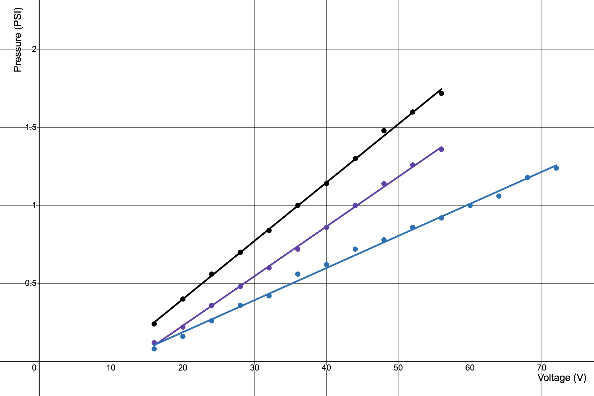

# Experimentation

This document outlines the protocol and results for the experiments that have been conducted on GentleGlide.

## Experiment 1: Voltage as a Function of PWM

**Experiment**: Because the voltage supplied to the vacuum is not provided by a voltage regulator but instead comes from a triac voltage dimmer, the voltage cannot be controlled directly. Rather, a PWM signal is provided to the voltage dimmer (which is represented as a "percentage" between 0%-100%) which then determines how much voltage is output from the dimmer. The relationship between the PWM percentage and actual voltage is not necessicarily linear, therefore this experiment was conducted to determine the mapping between PWM and voltage through the use of a voltmeter. 

**Results**: 

The black dots are the raw data points collected, and the red curve is a parametric fit for data points:

$$V(\text{PWM})=V_{\text{max}}\left(\frac{1-\cos(\pi(\text{PWM}+b))}{2}\right)\qquad0.1\leq\text{PWM}\leq 0.9,$$

$$\text{PWM}(V)=\frac{1}{\pi}\cos^{-1}\left(1-2\frac{V}{V_{\text{max}}}\right)-b\qquad 0.1\leq\text{PWM}\leq 0.9,$$

$$V_{\text{max}}\approx118.72,\quad b\approx0.07229.$$

**Conclusion**: The results show a strong non-linear relationship between PWM and voltage. For the following experiments, we use the curve fit provided above to determine what PWM percentage to use to achieve a desired voltage.

## Experiment 2: Pressure as a Function of Voltage

**Experiment**: This experiment determines the relationship between pressure inside the platform/sheet and voltage supplied to the air pump. The experiment was conducted at three different conditions: fully inverted, halfway inverted, and fully everted. For each condition, the experiment was conducted by recording a 20-30 second average of the pressure at each voltage level.

**Results**:

Black is fully inverted, purple is halfway inverted and blue is fully everted. The lines of best fits are:

$$P=0.019V-0.17,$$
$$P=0.016V-0.20,$$
$$P=0.010V-0.11,$$

respectively.

**Conclusion**: The results show a linear relationship between voltage and pressure in each of the conditions, indicating that increasing the desired pressure requires a proportional increase in power towards the air pump.

## Experiment 3: Pressure Needed to Lift a Given Weight

**Experiment**: This experiment determines the amount of pressure needed to lift a given weight off the ground by exactly 3.5 inches. The experiment was conducted by placing a spine board on a fully everted GentleGlide and placing kettlebells ontop of the spine board to mimic a human weight. The weights were not distributed evenly, they were distributed such that the shoulder and hip areas had roughly double the weight as the lower-back and leg areas.

**Results**:

The line of best fit (red) is given by:

$$P=0.0023W+0.035.$$

**Conclusion**: The relationship between weight and the amount of pressure needed to lift the weight a given height shows to be linear. Lifting 300lbs required 0.71 PSI, indicating that the GentleGlide should achieve at minimum that much pressure to invert under a 300lb human.

## Experiment 4: Torque Needed to Overcome a Given Pressure

**Experiment**: This experiment seeks to approximate the amount of torque required to invert with a given pressure inside the sheet. The experiment was conducted by first regulating the pressure to a constant setpoint, then winding the motor at a constant speed of 22.5 rpm until the cable was fully wrapped around the shaft. The average torque over time was recorded for each trial.

**Results**:

The line of best fit is given by:

$$\tau=3.64P+1.04.$$

**Conclusion**: The results show a linear relationship between pressure and torque, with each additional PSI of pressure requiring an additional 3.6 Nm of torque. Extrapolating on these results, 1 PSI of pressure (needed to lift 400 lbs) would require about 4.7 Nm of torque to invert.

## Experiment 5: Pressure Needed to Burrow Under a Given Weight

**Experiment**: TODO

**Results**:

**Conclusion**:

## Experiment 6: Pressure over Time as a Function of Leak

**Experiment**: TODO

**Results**:

**Conclusion**: