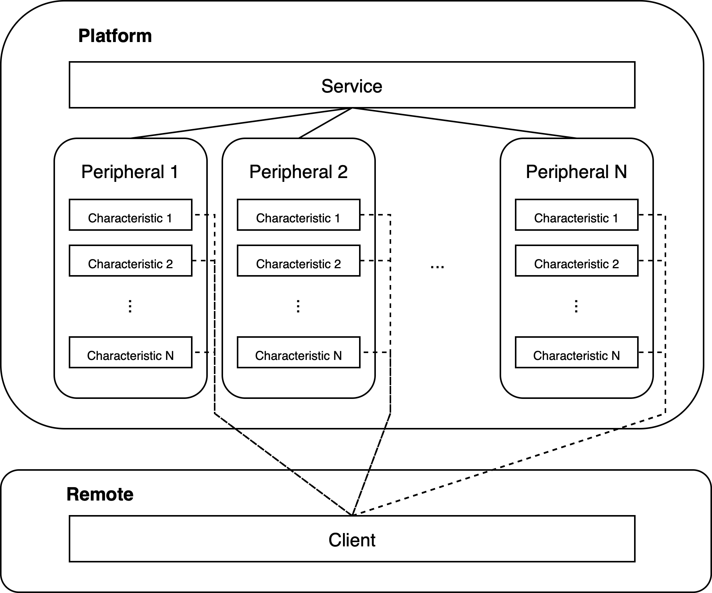

# Software Architecture

The software architecture used in GentleGlide/Wedge follows a client-service model and is directly based off the Bluetooth Low Energy (BLE) architecture (read this: https://randomnerdtutorials.com/esp32-bluetooth-low-energy-ble-arduino-ide/).

At a high level there are two major systems, the "platform" (representing GentleGlide/Wedge) and the "remote" (representing the physical remote controller or any application that can connect remotely). The platform consists of a single service which manages a group of peripherirals, while the remote consists of a single client that can connect to the platform and communicate data back and forth.

A "peripheral" is an abstraction over a module that provides functionality to the service. Each peripheral contains a list of "charactertistics", which are values that can be read/written to. For example, the ODrive motor controller is peripheral and has these characteristics: position (read-only), velocity (read/write), torque (read/write), error code (read-only). Another example of a peripheral is the voltage dimmer, which only has one characteristic: voltage (read/write). Note that peripherals do not need to be associated with a physical device wired to the platform, but can be "virtual" as well. For example, the pressure controller peripheral is simply a module that implements closed-loop pressure control by using the voltage dimmer and pressure sensor peripherals, but still has a characteristic that can be read/written to (the pressure setpoint).

When a client connects to the service, it is able to directly read/write to these characteristics, which allows for a simple yet effective form of communication between the remote and platform.

## List of Characteristics

The following is the list of characteristics/peripherals as of writing.

| Characteristic | Peripheral | Attributes |
|-|-|-|
| pressure | pressure sensor | read-only |
| pressure error code | pressure sensor | read-only |
| voltage | voltage dimmer | read/write |
| motor position | motor controller | read-only |
| motor velocity | motor controller | read/write |
| motor torque | motor controller | read/write |
| motor error code | motor controller | read-only |
| servo angle | servo | read/write |
| servo chamber number | servo | read/write |
| pressure setpoint | pressure controller | read/write |
| auto control mode | auto controller | read/write |
| auto control progress | auto controller | read-only |